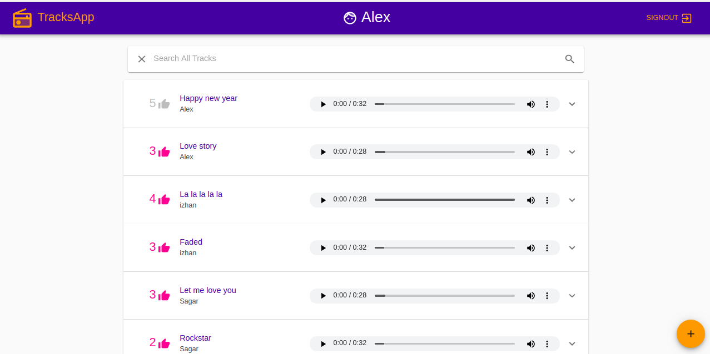
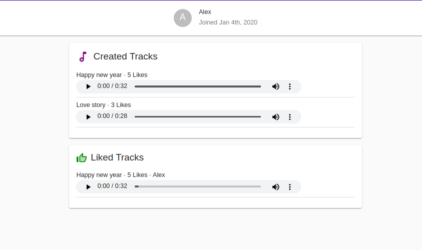

# Social Music App
> It is a music app called tracksApp where users can upload and share any music they like.

## Table of contents
* [General info](#general-info)
* [Screenshots](#screenshots)
* [Technologies](#technologies)

## General info
The is a music app called TracksApp where users can upload and share any music they like; users within the app will be able to interact with various tracks by liking them and adding tracks to their profile, searching for tracks, adding information about their music, as well as editing and deleting their tracks.

## Screenshots

## Technologies
* GraphQL API made with Python (Django and Graphene)
* a React app with React Hooks and Apollo Boost, state management React Context (with useContext) and Apollo Client State
* Media file uploads with Cloudinary / Cloudinary API

